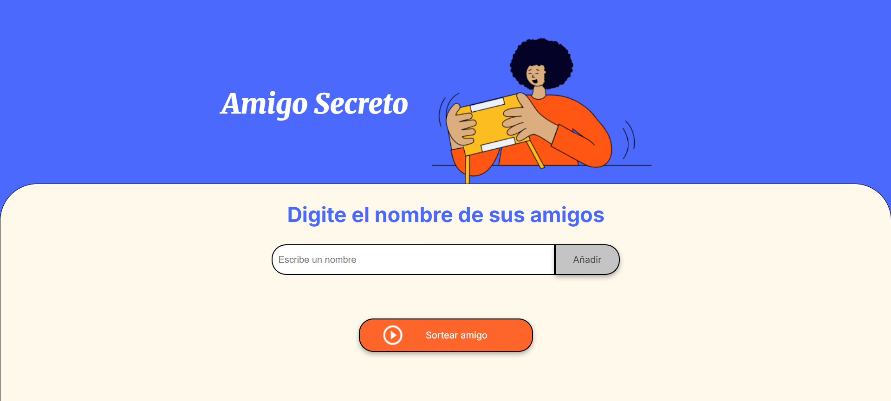
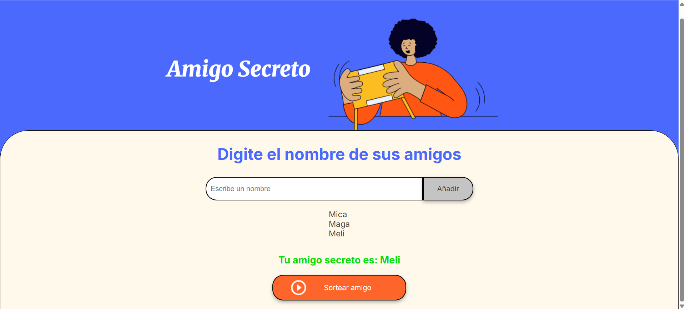
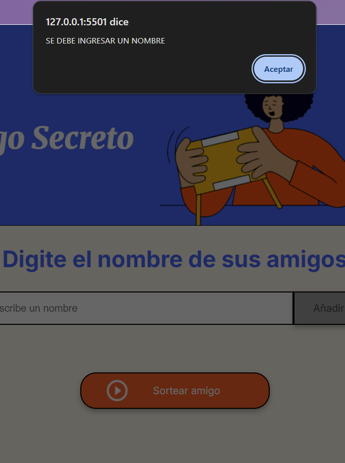

# Challenge - Amigo Secreto Alura
AMIGO SECRETO

Una aplicación web sencilla para organizar sorteos de Amigo Secreto de forma rápida y divertida.
Los usuarios pueden ingresar los nombres de los participantes y el sistema se encarga de seleccionar uno al azar.

Características: 

Permite ingresar nombres de los participantes.

Muestra la lista de amigos agregados.

Sortea automáticamente un amigo al azar.

Interfaz simple y fácil de usar.

Cómo usar:

Escribí el nombre de un amigo en el campo de texto.

Hacé clic en "Añadir" para sumarlo a la lista.

Una vez que tengas todos los nombres, presioná "Sortear amigo".

La página te mostrará quién es tu amigo secreto.

Tené en cuenta agregar un nombre antes de hacer clic en "Añadir".

Tecnologías utilizadas:

HTML5 – Estructura de la página.

CSS3 – Estilos y diseño.

JavaScript – Lógica del sorteo.